# 1. 목적
EC2에 할당되어 있는 public ip를 EC2 중지없이 제거합니다.

# 2. 설정 확인
public ip가 제거하고자 하는 ec2 instance 의 network 정보를 확인합니다.
1. subnet id : subnet-05d70e9db1821d3d5
2. public ip : 3.217.80.72
3. private ip : 172.31.52.58
4. EIP 사용 중
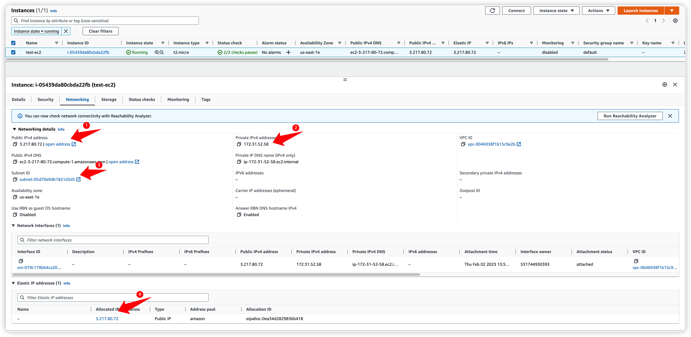

EIP 설정 전에도 public ip가 생성되었다면 subnet 에  `Auto-assign public IPv4 address` 가 Yes 설정되어 있어서 입니다. private subnet 이라면 Action -> Edit subnet settings 에서 `Enable auto-assign public IPv4 address` 체크를 해제하세요.
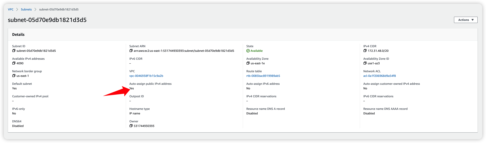

# 3. public ip 제거

새로운 네트워크 인터페이스 메뉴를 선택합니다.
1. Network Interfaces 메뉴에서
2. Create network interface 클릭합니다.
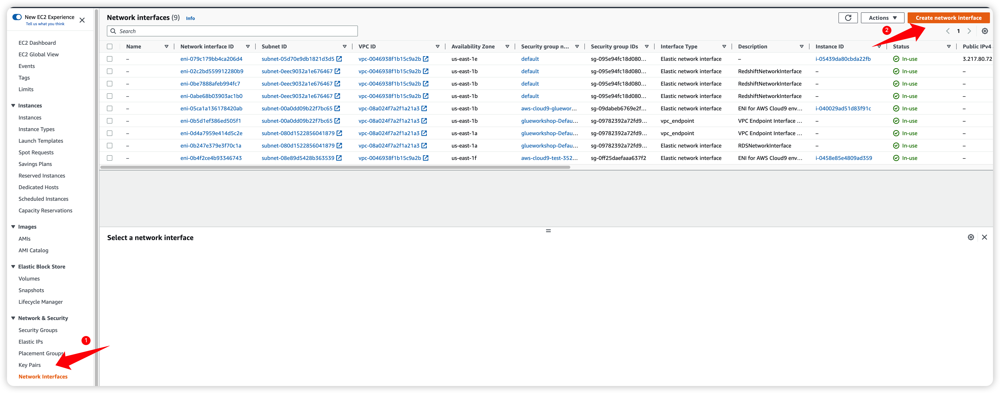

구분을 위해 `test-ni` 라는 이름으로 네트워크 인터페이스를 생성합니다.
1. Description 입력 : test-ni 
2. 대상 ec2가 속한 subnet 선택
3. security group 최소 하나 선택
4. tag 입력 : test-ni
5. Create network interface 선택
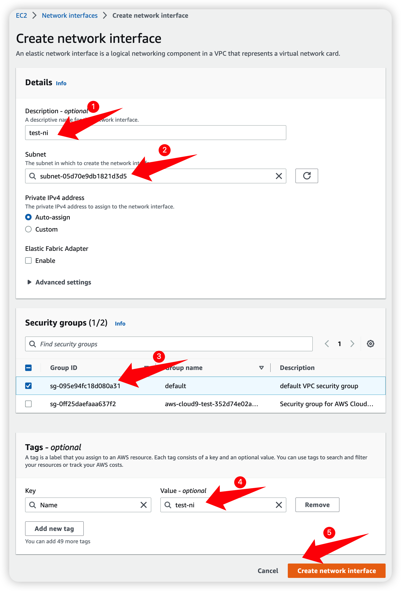

--- 
>*[중요] 
만약 EC2 에 Elastic IP 가 연결되어 있지 않다면 이 단계에서 Elastic IP를 연결하고 진행하세요. 
Elastic IP 연결이 되면 EC2의 public ip가 변경되므로 영향도 파악 및 주의가 필요합니다.*
---

생성된 네트워크 인터페이스를 대상 ec2에 연결합니다.
1. ec2 메뉴로 이동
2. Actions - Networking - Attach Network interface 클릭
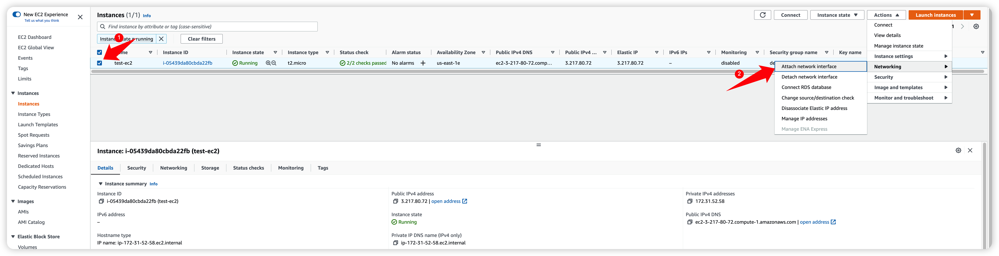

Attach network interface 화면에서
1. network interface 에 만들었던 인터페이스 네트워크(test-ni) 선택
2. Attach 클릭
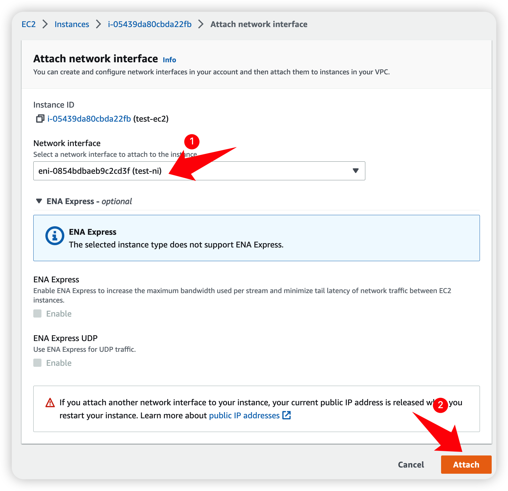

ec2 정보를 확인하여 private ip 가 추가로 할당 된 것을 확인합니다.
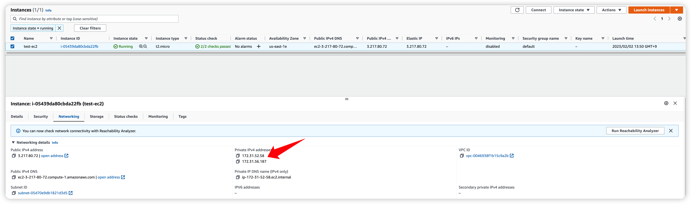

ec2에 연결 된 EIP를 삭제 합니다.
1. Elastic IPs 메뉴 클릭
2. ec2에 연결 된 EIP 선택
3. Actipns -> Dissociate Elastic IP address 선택
4. 팝업의 Disassociate 클릭
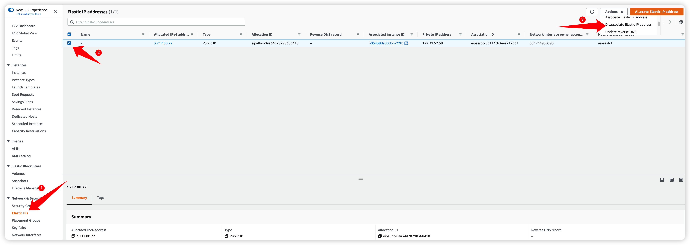
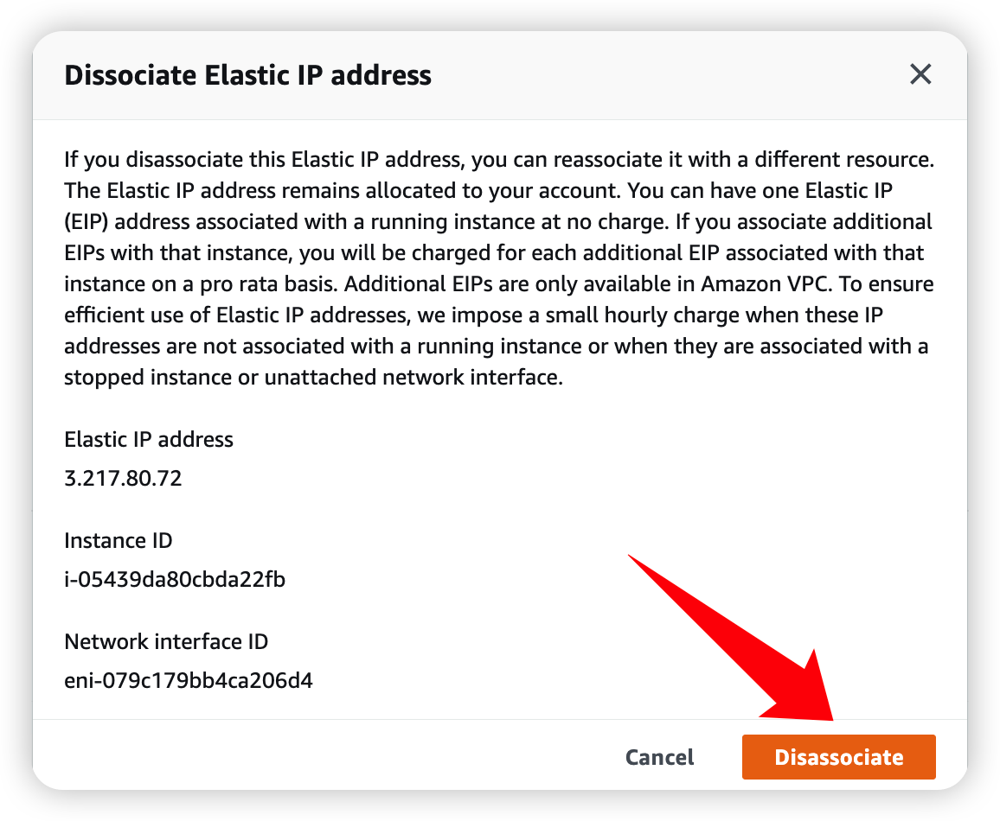

다시 ec2 메뉴로 돌아와서 해당 ec2 정보를 다시 확인하면 public ip가 사라진 것을 확인할 수 있습니다.
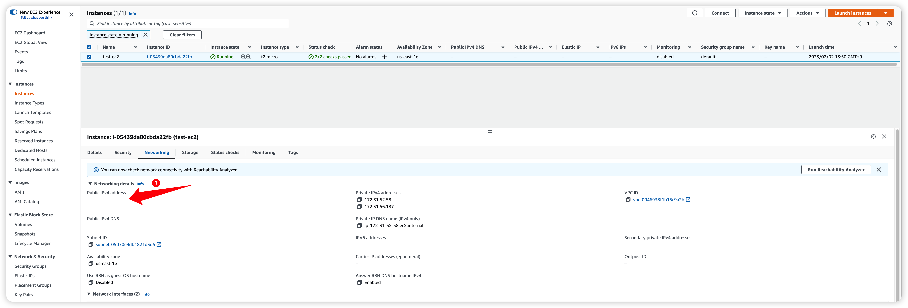

추가했던 네트워크 인터페이스를 ec2에서 분리합니다.
1. ec2 메뉴 클릭
2. ec2 인스턴스 체크
3. Actions - Networking - Detach Network interface 클릭
4. 이어서 나오는 팝업에서 만들었던 네트워크 인터페이스 `test-ni` 선택 후 `Detach` 클릭
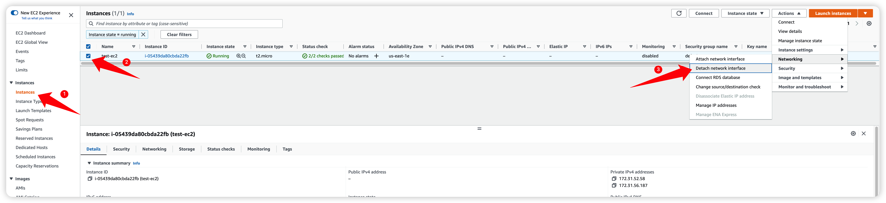
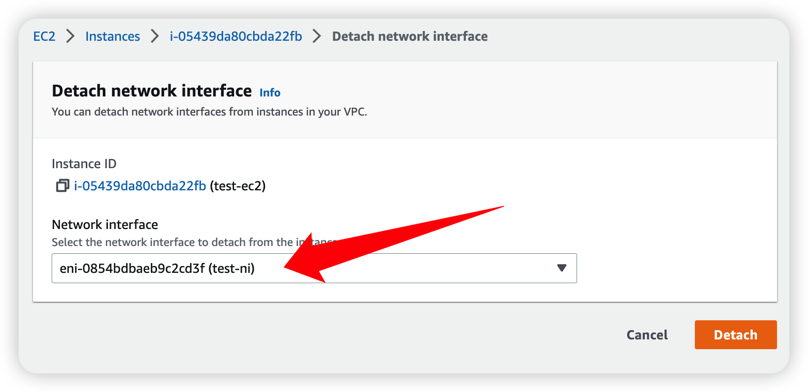

네트워크 인터페이스를 삭제합니다.
1. Network interface 메뉴 클릭
2. `test-ni` 체크
3. Actions - Delete 선택
4. 이어서 나오는 팝업에서 Delete 선택
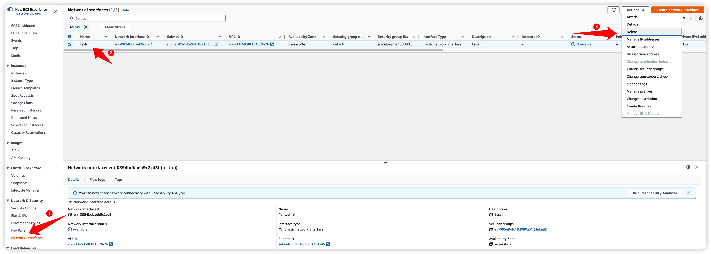
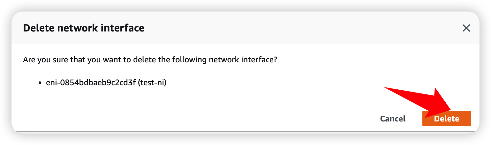

다시 ec2의 정보를 확인하면 
1. public ip 제거
2. private ip 기존 동일 
상태를 확인할 수 있습니다.
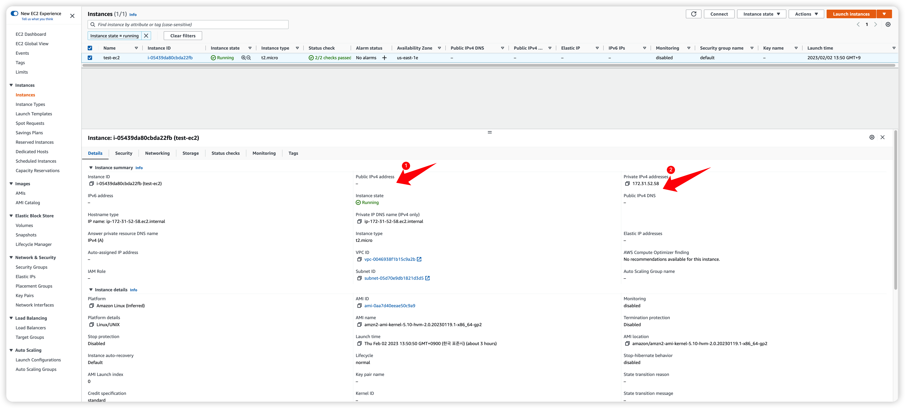